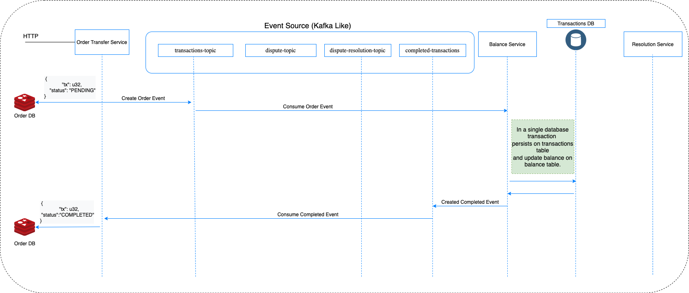
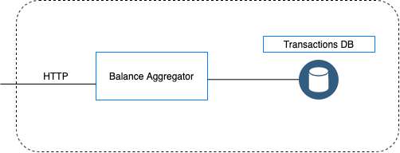

# Toy Finance
Rust Simple Toy Engine for transactions.  

At first, the engine read transactions from a CSV file, execute all transactions
and output on a CSV format.

## Goal

The goal of the project is to evolve to a complete example of a transaction system in Rust.

In the future it will be composed of different microservices, using SAGA, Event Sourcing, and CQRS.

It will be like the [realworld project](https://github.com/gothinkster/realworld), but for SAGA.

## Types of Transactions

### Deposit
A deposit is a credit to the client's asset account, meaning it increases the available funds and
total funds of the client account.

A deposit looks like,
| type          | client        | tx            | amount        |
| :---:         | :---:         | :---:         | :---:         |
| deposit       | 1             |      1        |     1000.00   |

**Assumptions**  
If the deposit references a client that does not exist, it will create a new one.

### Withdrawal
A withdrawal is a debit to the client's asset account, meaning it decreases the available and
total funds of the client account.

A withdrawal looks like,
| type          | client        | tx            | amount        |
| :---:         | :---:         | :---:         | :---:         |
| withdrawal    | 1             |      1        |     1000.00   | 

**Assumptions**  
If a client does not have sufficient available funds the withdrawal should fail, and the total amount of funds should not change.  
If the client of withdrawal does not exist, it will not create a new one.

### Dispute
A dispute represents a client's claim that a transaction was erroneous and should be reversed.  
The transaction shouldn't be reversed yet but the associated funds should be held. 
This means that the client's available funds will decrease by the amount disputed, their held funds will increase by the amount disputed, while their total funds will remain the same.

A dispute looks like,
| type          | client        | tx            | amount        |
| :---:         | :---:         | :---:         | :---:         |
| dispute    | 1             |      1           |               | 

**Assumptions**  
A dispute does not state the amount disputed. 
Instead, a dispute references the transaction that is disputed by ID.  
If the tx specified by the dispute doesn't exist it will be ignored.

### Resolve
A resolve represents a resolution to a dispute, releasing the associated held funds.  
Funds that were previously disputed are no longer disputed.  
This means that the clients held funds will decrease by the amount no longer disputed, 
their available funds will increase by the amount no longer disputed, and their total funds will remain the same.

A resolve looks like,
| type          | client        | tx            | amount        |
| :---:         | :---:         | :---:         | :---:         |
| resolve       | 1             |      1        |               | 

**Assumptions**  
Like disputes, resolves do not specify an amount.
Instead, they refer to a transaction that was under dispute by ID. 
If the tx specified doesn't exist, or the tx isn't under dispute, it will be ignored.

### Chargeback
A chargeback is the final state of a dispute and represents the client reversing a transaction. 
Funds that were held have now been withdrawn.  
This means that the clients held funds and total funds will decrease by the amount previously disputed.  
If a chargeback occurs the client's account will be immediately frozen.

A chargeback looks like,
| type          | client        | tx            | amount        |
| :---:         | :---:         | :---:         | :---:         |
| chargeback    | 1             |      1        |               | 

**Assumptions**  
Like a dispute, and a resolve a chargeback refers to the transaction by ID (tx) and does not
specify an amount.
Like a resolve, if the tx specified doesn't exist, or the tx isn't under dispute, the chargeback will be ignored.
## Using
```
cargo run --release -- <path_to_csv> > result.csv
```
## Example
Given the CSV below,
```
type, client, tx, amount
deposit, 1, 1, 1.0
deposit, 2, 2, 2.0
deposit, 1, 3, 2.0
withdrawal, 1, 4, 1.5
withdrawal, 2, 5, 3.0
```
The output will be,
```
client,available,held,total,locked
1,1.5,0.0,1.5,false
2,2.0,0.0,2.0,false
```
# Target Architecture
Check the diagrams below to see the target architecture.
### Withdraw and Deposit Scenario

### Dispute with Resolution Scenario

### Balance Aggregator


As seen in the diagrams above, the target architecture will be composed of different microservices.

### Order Transfer Service
A BFF(Back-end for front-end), will receive the transaction intention, respond immediately with the transaction ID and generate a transaction event.
It will store the transaction ID and the transaction's status as Pending on a KV value store, with a time-to-live set to the business requirement for a transaction to complete.

### Balance Service
The core microservice of the solution will be responsible to properly execute the transactions.

It will consume the event from the order topic, and accordingly to the transaction type, will act on the database.

If the transaction is a Withdrawal or Deposit, it will insert the transaction on the system of record table (Event Sourcing), and update the balance of the client.
If the transaction is a Dispute, it will generate an event to the dispute topic.

This microservice will also consume the dispute-resolution topic, where will arrive events with the result of a dispute. 

Doing the compensation transaction (SAGA) for the chargeback event.

With this approach, the system will be able to execute the transactions in an async manner and also be able to retrieve the balance at a given time for any client, using the transactions table.

The balance table will be consistent with the sum of the transactions for a given client, because the two tables will be executed in a single database transaction, so, if the balance update fails, the transaction will also fail.

It's the only service that changes the values on the balance and transactions tables.

### Resolution Service
It will be the service responsible for finalizing a dispute.
Either returning a Resolve or a Chargeback.
Because only the Balance Service is allowed to change values on those tables, the resolution service will create a Resolution Event which will be consumed by the Balance Service.

### Balance Aggregator
It will be responsible to do read transactions on the balance table.
Providing functionality as retrieving the transaction history from the last 30 days.
Retrieve the current balance of an account, etc...
Those functionalities should not be on the Balance Service, respecting the CQRS, we can the read portion of the balance independently of the write portion.